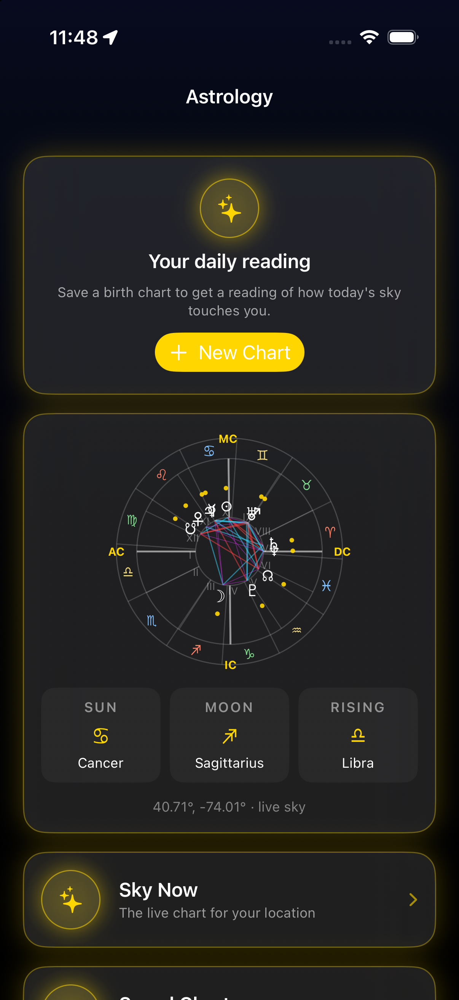
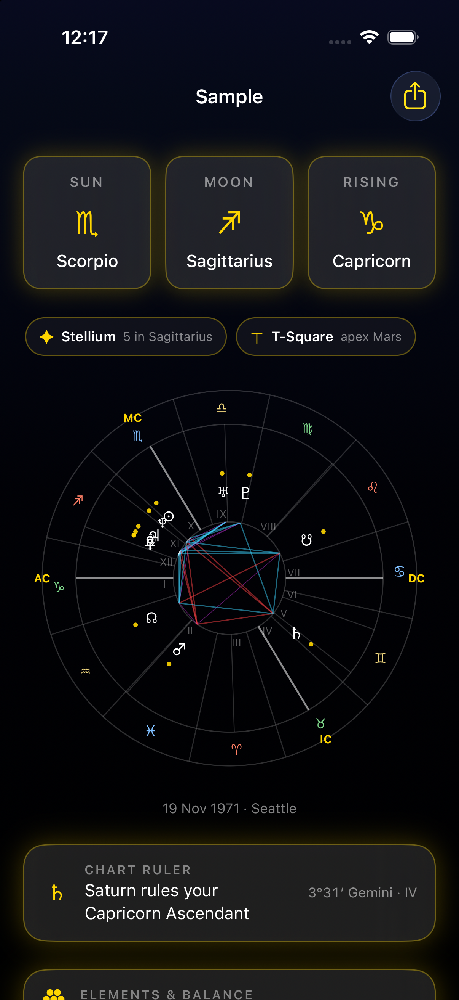

<div align="center">

# Selenia

**A natal chart app for iOS that computes the sky instead of looking it up.**

</div>

---

Selenia is the astrology sibling of [Astrelia](https://github.com/pharmacykitty/Astrelia), and it runs on the same astronomy engine. The Sun, Moon and planets come from real ephemeris math, and houses are solved for the actual birthplace and minute. It started as a layer inside Astrelia and was split out in July 2026 so the planetarium could stay purely about astronomy.

It never made it onto the App Store. Apple rejected it under guideline 4.3, their rule for categories they consider saturated, and astrology is one of them. So it lives here instead, and you can build it and run it yourself.

<table>
  <tr>
    <td align="center"><br><sub><b>Home</b>, today and the live sky</sub></td>
    <td align="center"><br><sub><b>Natal chart</b>, wheel, patterns, readings</sub></td>
    <td align="center"><br><sub><b>Celestial sphere</b>, the chart on the real sky</sub></td>
  </tr>
</table>

<sub>The screenshots use a made-up sample chart. They were taken while the app was still called Ecliptica, so a few titles may differ.</sub>

## What it does

**Birth charts.** Type a birthplace and it geocodes the coordinates and timezone, then draws the full wheel with Placidus, Whole Sign, Equal or Porphyry houses, dignities, chart patterns like grand trines, T-squares and yods, house rulers and elemental balance.

**The celestial sphere.** Your chart drawn onto the actual sky in 3D: real catalog stars, the ecliptic, the houses as great circles and aspect chords between the planets. There's a guided tour, and you can scrub time.

**Transits and predictive work.** What's touching the chart now and next, retrograde stations with exact dates, secondary progressions, solar and lunar returns, and solar arc.

**Relationships.** Synastry between any two saved charts, composite charts and a compatibility read.

**Readings.** A deterministic interpretation engine built from keyword tables written for this project, so the same chart always reads the same way and nothing is borrowed from a book.

**Sharing.** Chart posters, and the sphere exported as a GIF or MP4.

## How it's put together

```
App/
  Charts/        saved charts, transits, predictive, synastry, the sphere, sharing
  Screens/       home, the chart wheel, About
  Sky/           star catalog and constellation loading for the sphere
  DesignSystem/  theme, glyphs, small shared views
  Resources/     stars.bin, constellation lines
docs/            the astrology spec, feature plan and sphere design notes
project.yml      XcodeGen spec
```

All the math lives in [AstroPackages](https://github.com/pharmacykitty/AstroPackages): `CelestialCore` for the astronomy and `Astrology` for zodiac, houses, aspects, transits, synastry, progressions and interpretation. Both packages are pure Swift 6 with tests, and the charts were validated against astro.com reference charts.

## Building it

You need Xcode 27 with the iOS 26 SDK and [XcodeGen](https://github.com/yonaskolb/XcodeGen). Check out AstroPackages next to this repo, because `project.yml` points at `../AstroPackages`:

```sh
git clone https://github.com/pharmacykitty/Selenia.git
git clone https://github.com/pharmacykitty/AstroPackages.git
cd Selenia
brew install xcodegen
xcodegen generate
open Selenia.xcodeproj
```

Set `DEVELOPMENT_TEAM` in `project.yml` (or in Xcode) to your own team to run on a device. The simulator works without one.

To run the tests:

```sh
cd ../AstroPackages/Astrology && swift test
```

## License

The code is GPL-3.0 (see `LICENSE`). The star data is CC BY-SA 4.0 from the HYG database and the constellation lines are BSD-3-Clause from d3-celestial; both are credited in [`NOTICE.md`](NOTICE.md).
